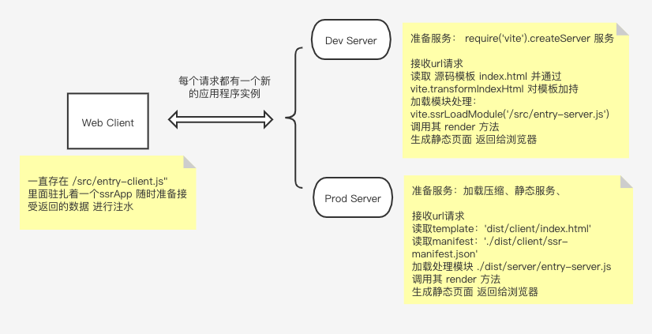

# Vite SSR

## SSR （server side render）
SSR 特别指支持在 Node.js 中运行相同应用程序的前端框架（如：Vue），将其预渲染成 HTML，最后在客户端进行注水化处理。

## 结构说明
```
.
├── README.md
├── __tests__
│   ├── serve.js
│   └── ssr-vue.spec.ts
├── dist
│   ├── client 【 客户端构建 】
│   │   ├── assets 【 静态资源 】
│   │   │   ├── About.66d89e61.css
│   │   ├── index.html 【 构建后的模板供生产环境server使用 】
│   │   └── ssr-manifest.json
│   ├── server 【 服务端端构建 】
│   │   └── entry-server.js
│   └── static 【 静态站点生成目录 】
│       ├── about.html
│       ├── assets
│       │   ├── About.66d89e61.css
│       └── index.html
├── index.html 【 内置一些占位标记供给开发环境server渲染时注入 】
├── package-lock.json
├── package.json
├── prerender.js 【 预渲染生成静态站点 】
├── server.js 【 项目入口 】
├── src
│   ├── App.vue
│   ├── assets
│   │   └── logo.png
│   ├── components
│   │   ├── Foo.jsx
│   │   ├── ImportType.vue
│   │   └── foo.css
│   ├── entry-client.js 【 将应用挂着到DOM上 】
│   ├── entry-server.js 【 使用框架的 SSR API 渲染该应用 】
│   ├── main.js 【 👆以上两个文件公用代码 导出 createApp 】
│   ├── pages
│   │   ├── About.vue
│   │   └── Home.vue
│   └── router.js
├── vite.config.js  【 vite 配置文件 】
└── vite.config.noexternal.js   【 vite SSR外部化 配置文件 】
```

## 代码分析

1、每次请求都会输出一个新的 vue 应用实例

2、设置 server.js

**设置开发服务器**
```javascript
const express = require('express')
const { createServer: createViteServer } = require('vite')

async function createServer() {

  const fs = require('fs')
  const path = require('path')
  const app = express()

  // 以中间件模式创建 vite 应用
  // (vite 是 ViteDevServer 的一个实例)
  const vite = await createViteServer({
    server: { middlewareMode: 'ssr' }
  })

  // 使用 vite 的 Connect 实例作为中间件
  // (vite.middlewares 是一个 Connect 实例)
  app.use(vite.middlewares)

  // * 处理程序供给服务端渲染的 HTML
  app.use('*', async (req, res) => {

    const url = req.originalUrl

    // 读取 index.html
    let template = fs.readFileSync(
      path.resolve(__dirname, 'index.html'),
      'utf-8'
    )

    // 将上面👆拿到的HTML 交给vite 处理
    // 会注入 vite HMR 客户端，
    // 同时也会从 Vite 插件应用 HTML 转换
    template = await vite.transformIndexHtml(url, template)    
    
    // 通过 vite.ssrLoadModule 加载服务器入口 将自动转换
    // 使 ESM 源码 可以以在 Node.js 中运行 
    const { render } = await vite.ssrLoadModule('/src/entry-server.js')
    
    // 根据 entry-server.js 导出的 `render` 渲染应用的 HTML
    // render 函数调用了  renderToString()  
    // 该函数将应用实例渲染为一个字符串
    // 此函数返回一个 Promise 来解析渲染出的 HTML
        const appHtml = await render(url)
    
    // 注入渲染后的 appHtml 到模板中
    const html = template.replace(`<!--ssr-outlet-->`, appHtml)

    // 向客户端返回渲染后的 HTML
    res.status(200).set({ 'Content-Type': 'text/html' }).end(html)    
    
  })

  app.listen(3000)
}

createServer()
```

 **生产环境的特定逻辑:**
1. 使用 dist/client/index.html 作为模板，而不是根目录的 index.html，因为前者包含了到客户端构建的正确资源链接

2. 使用 require('./dist/server/entry-server.js') ，而不是 await vite.ssrLoadModule('/src/entry-server.js')（前者是 SSR 构建后的最终结果）


## package.json

*注意 使用 --ssr 标志表明这将会是一个 SSR 构建。同时需要指定 SSR 的入口。*

*vite build 支持使用 --ssrManifest 标志，这将会在构建输出目录中生成一份 ssr-manifest.json：*


```json
  "scripts": {
     // 开发环境
    "dev": "node server",
    // build
    "build": "yarn build:client && yarn build:server",
    "build:noExternal": "yarn build:client && yarn build:server:noExternal",
    "build:client": "vite build --ssrManifest --outDir dist/client",
    "build:server": "vite build --ssr src/entry-server.js --outDir dist/server",
    "build:server:noExternal": "vite build --config vite.config.noexternal.js --ssr src/entry-server.js --outDir dist/server",
    // 预编译生成静态文件
    "generate": "vite build --ssrManifest --outDir dist/static && yarn build:server && node prerender",
    // 生产环境
    "serve": "cross-env NODE_ENV=production node server",
    "debug": "node --inspect-brk server"
  },
```

## 流程图

